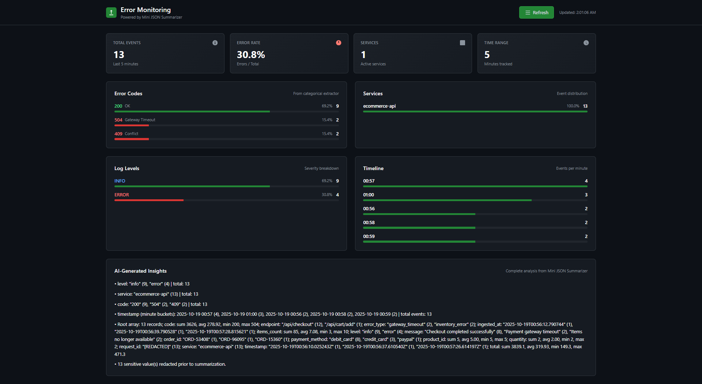

# Mini JSON Summarizer

[](https://github.com/stevenmcsorley/mini-json-summarizer/actions)
[](https://www.python.org/downloads/)
[](https://opensource.org/licenses/MIT)

**Deterministic-first service for summarizing large JSON payloads** with evidence, citations, redaction, and optional LLM refinement. Purpose-built for incident triage, compliance reporting, and operational insights.

---



## ✨ Key Features

- **🎯 Domain-Specific Profiles** - Pre-configured extractors for logs, metrics, and policy analysis
- **📊 Evidence-Based Summarization** - Every claim backed by JSONPath citations with value previews
- **🔒 PII-Safe by Default** - Configurable redaction with field-level allow/deny lists
- **⚡ Streaming SSE Support** - Real-time bullets via Server-Sent Events for live dashboards
- **🤖 Optional LLM Integration** - Natural language summaries (OpenAI, Anthropic, Ollama) with zero hallucinations
- **🐳 Production-Ready** - Docker support, health checks, CORS, comprehensive test suite

---

## 🚀 Quick Start

```bash
# Install
python -m venv .venv
source .venv/bin/activate  # Windows: .venv\Scripts\activate
pip install -e .[dev]

# Run
uvicorn app.main:app --reload --port 8080

# Health check
curl http://localhost:8080/healthz
# -> {"status":"ok","engine":"deterministic","version":"1.0.0"}
```

### Basic Summarization

```bash
curl -X POST http://localhost:8080/v1/summarize-json \
  -H "Content-Type: application/json" \
  -d '{
    "json": {
      "orders": [
        {"id": 1, "total": 20, "status": "paid"},
        {"id": 2, "total": 40, "status": "paid"},
        {"id": 3, "total": 5, "status": "failed"}
      ]
    },
    "stream": false
  }'
```

**Response:**

```json
{
  "engine": "deterministic",
  "bullets": [
    {
      "text": "orders: 3 records; total: sum 65, avg 21.67, min 5, max 40 | status: paid (2), failed (1)",
      "citations": [
        { "path": "$.orders[*].total", "value_preview": [20, 40, 5] },
        {
          "path": "$.orders[*].status",
          "value_preview": ["paid", "paid", "failed"]
        }
      ],
      "evidence": {
        "records": 3,
        "total": {
          "count": 3,
          "sum": 65.0,
          "min": 5.0,
          "max": 40.0,
          "avg": 21.67
        },
        "status": {
          "top": [
            ["paid", 2],
            ["failed", 1]
          ]
        }
      }
    }
  ],
  "evidence_stats": { "paths_count": 2, "bytes_examined": 254, "elapsed_ms": 7 }
}
```

---

## 📋 Profiles System

**Domain-specific extractors and defaults** for common use cases. No code changes needed—just add YAML files.

### Available Profiles

| Profile     | Use Case                        | Extractors                                                                | Best For                                                |
| ----------- | ------------------------------- | ------------------------------------------------------------------------- | ------------------------------------------------------- |
| **logs**    | Incident triage, error tracking | `categorical:level`, `categorical:service`, `timebucket:timestamp:minute` | Application logs, ELB/nginx logs, incident post-mortems |
| **metrics** | SLO health, capacity planning   | `numeric:latency_ms`, `numeric:cpu_percent`, `categorical:endpoint`       | Performance monitoring, KPI dashboards, FinOps          |
| **policy**  | Compliance, drift detection     | `categorical:action`, `diff:baseline`                                     | IAM policy changes, access reviews, compliance audits   |

### Discover Profiles

```bash
curl http://localhost:8080/v1/profiles
```

**Response:**

```json
[
  {
    "id": "logs",
    "version": "1.0.0",
    "title": "Log Analysis Profile",
    "description": "Extracts error patterns, service health, and temporal trends"
  },
  {
    "id": "metrics",
    "version": "1.0.0",
    "title": "Metrics and KPI Profile",
    "description": "Focuses on numeric statistics and performance indicators"
  },
  {
    "id": "policy",
    "version": "1.0.0",
    "title": "Policy and Compliance Profile",
    "description": "Analyzes policy changes with baseline comparison"
  }
]
```

---

## 🎯 Real-World Use Cases

### 1️⃣ Incident Triage (Logs Profile)

**Scenario:** 10MB log export from a production outage

```bash
curl -N -X POST http://localhost:8080/v1/summarize-json \
  -H "Content-Type: application/json" \
  -d '{
    "profile": "logs",
    "json": {
      "logs": [
        {"timestamp": "2025-10-18T10:11:00Z", "level": "error", "service": "api", "code": 504},
        {"timestamp": "2025-10-18T10:11:10Z", "level": "warn", "service": "api", "code": 499},
        {"timestamp": "2025-10-18T10:11:29Z", "level": "error", "service": "auth", "code": 401}
      ]
    },
    "stream": true
  }'
```

**What You Get:**

- ✅ Error level breakdown (`error: 2, warn: 1`)
- ✅ Service distribution (`api: 2, auth: 1`)
- ✅ Temporal spikes (minute buckets show 10:11 concentration)
- ✅ Top error codes (`504, 499, 401`)

**Why It Matters:** First 5 minutes of clarity—identify failing service fast.

---

### 2️⃣ Release Regression Check (Diff Baseline)

**Scenario:** Compare logs before/after deploy

```bash
curl -X POST http://localhost:8080/v1/summarize-json \
  -d '{
    "profile": "policy",
    "json": {"policies": [{"id": 1, "action": "allow", "scope": "admin"}]},
    "baseline_json": {"policies": [{"id": 1, "action": "deny"}]},
    "stream": false
  }'
```

**What You Get:**

```json
{
  "bullets": [
    {
      "text": "Baseline diff: added 1 paths (e.g., $.policies[0].scope)",
      "citations": [{ "path": "$.policies[0].scope" }],
      "evidence": {
        "added": 1,
        "removed": 0,
        "added_paths": ["$.policies[0].scope"]
      }
    }
  ]
}
```

**Why It Matters:** Surface new permissions or error codes introduced by deployment.

---

### 3️⃣ SLO Health Report (Metrics + Hybrid LLM)

**Scenario:** KPI snapshot for exec review

```bash
curl -X POST http://localhost:8080/v1/summarize-json \
  -d '{
    "profile": "metrics",
    "engine": "hybrid",
    "json": {
      "latency_ms": [95, 120, 140, 180, 220],
      "cpu": [0.4, 0.6, 0.9, 0.85, 0.75],
      "error_rate": [0.01, 0.02, 0.05, 0.03, 0.02]
    },
    "stream": false
  }'
```

**What You Get (Hybrid Output):**

```json
{
  "bullets": [
    {
      "text": "Latency averaged 151ms (min: 95ms, max: 220ms), with a notable spike above 200ms indicating potential performance degradation during peak load.",
      "citations": [{ "path": "$.latency_ms[*]" }],
      "evidence": {
        "field": "latency_ms",
        "count": 5,
        "mean": 151.0,
        "min": 95.0,
        "max": 220.0
      }
    }
  ]
}
```

**Why It Matters:** Natural language + evidence citations = exec-ready + auditable.

---

### 4️⃣ PII-Safe Vendor Handoff

**Scenario:** Share incident summary with vendor without leaking secrets

```bash
# Profile redacts $..*token, $..*password by default
# Allows $.level, $.service for safe sharing
curl -X POST http://localhost:8080/v1/summarize-json \
  -d '{
    "profile": "logs",
    "json": {
      "logs": [
        {"level": "error", "service": "api", "token": "secret123"},
        {"level": "warn", "service": "db", "password": "hunter2"}
      ]
    }
  }'
```

**What You Get:** Bullets with `level` and `service` visible, `token`/`password` redacted from evidence.

**Why It Matters:** Share context with third parties safely and reproducibly.

---

## 🤖 LLM Integration (Optional)

Combine deterministic evidence with natural language summaries. **Zero hallucinations** guaranteed.

### Setup

```bash
# .env file
LLM_PROVIDER=openai          # or anthropic, ollama
LLM_MODEL=gpt-4o-mini
OPENAI_API_KEY=sk-proj-...
LLM_FALLBACK_TO_DETERMINISTIC=true
```

### Available Engines

| Engine          | How It Works                              | When to Use                          |
| --------------- | ----------------------------------------- | ------------------------------------ |
| `deterministic` | Rule-based extraction, JSONPath citations | Default, no API costs, fully offline |
| `llm`           | LLM rephrases evidence bundles only       | Natural language for humans          |
| `hybrid`        | Deterministic + LLM refinement            | **Recommended**: Best of both worlds |

### Safety Guarantees

✅ **Evidence-Only Input** - LLM never sees raw JSON
✅ **Constrained Prompts** - System prompts enforce "no new facts" rule
✅ **Citation Preservation** - All claims traceable to JSONPath
✅ **Fallback Mode** - Degrades to deterministic if LLM fails

### Example: Hybrid Engine

```bash
curl -X POST http://localhost:8080/v1/summarize-json \
  -d '{
    "profile": "logs",
    "engine": "hybrid",
    "json": {"logs": [...]},
    "stream": false
  }'
```

**Deterministic Output:**

```
level: error (5), warn (3) | service: api (4), auth (2)
```

**Hybrid Output:**

```
The logs show a critical error concentration in the API service (5 errors vs 3 warnings),
with authentication service experiencing 2 errors during the same timeframe.
```

Both outputs include identical `citations` and `evidence` fields.

---

## 🧪 Testing

**All 19 tests passing** (12 core + 7 profiles)

```bash
pytest
```

**Test Coverage:**

- ✅ Core summarization (deterministic engine)
- ✅ Streaming SSE format
- ✅ PII redaction
- ✅ Baseline diff comparison
- ✅ Profile loading and validation
- ✅ Profile extractors (categorical, numeric, timebucket, diff)
- ✅ Backward compatibility

```
============================= test session starts =============================
tests/test_api.py::test_summarize_endpoint_returns_bullets PASSED        [  5%]
tests/test_api.py::test_streaming_format_emits_phase_objects PASSED      [ 10%]
tests/test_api.py::test_payload_too_large_error_structured PASSED        [ 15%]
tests/test_api.py::test_depth_limit_error_structured PASSED              [ 21%]
tests/test_api.py::test_chat_endpoint_focuses_on_last_user_message PASSED [ 26%]
tests/test_api.py::test_invalid_json_body_structured PASSED              [ 31%]
tests/test_api.py::test_healthz_endpoint PASSED                          [ 36%]
tests/test_deterministic_engine.py::test_deterministic_engine_generates_bullets PASSED [ 42%]
tests/test_deterministic_engine.py::test_deterministic_engine_redacts_sensitive_values PASSED [ 47%]
tests/test_deterministic_engine.py::test_mixed_type_field_summary PASSED [ 52%]
tests/test_deterministic_engine.py::test_delta_summary_includes_changes PASSED [ 57%]
tests/test_deterministic_engine.py::test_plural_helper PASSED            [ 63%]
tests/test_profiles.py::test_profiles_loaded PASSED                      [ 68%]
tests/test_profiles.py::test_list_profiles_endpoint PASSED               [ 73%]
tests/test_profiles.py::test_unknown_profile_400 PASSED                  [ 78%]
tests/test_profiles.py::test_no_profile_backward_compat PASSED           [ 84%]
tests/test_profiles.py::test_logs_profile_extractors PASSED              [ 89%]
tests/test_profiles.py::test_profile_precedence PASSED                   [ 94%]
tests/test_profiles.py::test_metrics_profile PASSED                      [100%]

============================== 19 passed in 0.87s ==============================
```

---

## 🐳 Docker

```bash
# Build
docker build -t mini-json-summarizer .

# Run
docker run -p 8080:8080 \
  -e LLM_PROVIDER=openai \
  -e OPENAI_API_KEY=sk-proj-... \
  mini-json-summarizer

# Health check
curl http://localhost:8080/healthz
```

**Docker features:**

- ✅ Multi-stage build for smaller images
- ✅ Profiles directory included
- ✅ Environment variable configuration
- ✅ Health endpoint for orchestration

---

## ⚙️ Configuration

### Core Settings

| Variable                   | Default    | Description          |
| -------------------------- | ---------- | -------------------- |
| `MAX_PAYLOAD_BYTES`        | `20971520` | Max JSON size (20MB) |
| `MAX_JSON_DEPTH`           | `64`       | Max nesting level    |
| `PII_REDACTION_ENABLED`    | `true`     | Enable PII scrubbing |
| `ALLOW_ORIGINS`            | `["*"]`    | CORS whitelist       |
| `STREAMING_CHUNK_DELAY_MS` | `100`      | SSE event cadence    |

### Profile Settings

| Variable              | Default    | Description             |
| --------------------- | ---------- | ----------------------- |
| `PROFILES_ENABLED`    | `true`     | Enable profiles system  |
| `PROFILES_DIR`        | `profiles` | YAML directory          |
| `PROFILES_HOT_RELOAD` | `false`    | Watch for changes (dev) |

### LLM Settings (Optional)

| Variable                        | Default                  | Description                                |
| ------------------------------- | ------------------------ | ------------------------------------------ |
| `LLM_PROVIDER`                  | `none`                   | `openai`, `anthropic`, `ollama`, or `none` |
| `LLM_MODEL`                     | Provider-specific        | Model identifier                           |
| `OPENAI_API_KEY`                | -                        | OpenAI API key                             |
| `ANTHROPIC_API_KEY`             | -                        | Anthropic API key                          |
| `OLLAMA_BASE_URL`               | `http://localhost:11434` | Ollama server URL                          |
| `LLM_MAX_TOKENS`                | `1500`                   | Max response tokens                        |
| `LLM_TEMPERATURE`               | `0.1`                    | Lower = more deterministic                 |
| `LLM_FALLBACK_TO_DETERMINISTIC` | `true`                   | Fallback on error                          |

---

## 🌐 Supported LLM Providers

### OpenAI

- **Models:** `gpt-4o-mini`, `gpt-4o`, `gpt-4-turbo`
- **Cost:** ~$0.15 per 1M tokens (gpt-4o-mini)
- **Speed:** Fast (100-500ms)

### Anthropic Claude

- **Models:** `claude-3-haiku-20240307`, `claude-3-sonnet-20240229`
- **Cost:** $0.25 per 1M tokens (haiku)
- **Accuracy:** Excellent instruction following

### Ollama (Local)

- **Models:** `llama3.2`, `mistral`, `phi`, `codellama`
- **Cost:** Free (runs locally)
- **Privacy:** No data leaves your machine
- **Setup:** `ollama pull llama3.2`

---

## 📚 API Reference

### `POST /v1/summarize-json`

**Request:**

```json
{
  "json": {...},                    // Required: JSON payload
  "profile": "logs",                // Optional: Profile ID
  "engine": "hybrid",               // Optional: deterministic, llm, hybrid
  "focus": ["field1", "field2"],    // Optional: Field targeting
  "baseline_json": {...},           // Optional: Diff comparison
  "stream": true                    // Optional: SSE mode
}
```

**Response (non-streaming):**

```json
{
  "engine": "hybrid",
  "profile": "logs",
  "bullets": [
    {
      "text": "Human-readable summary",
      "citations": [{"path": "$.field", "value_preview": [...]}],
      "evidence": {...}
    }
  ],
  "evidence_stats": {
    "paths_count": 10,
    "bytes_examined": 1024,
    "elapsed_ms": 50
  }
}
```

**Response (streaming SSE):**

```
data: {"phase":"summary","bullet":{...}}

data: {"phase":"summary","bullet":{...}}

data: {"phase":"complete","evidence_stats":{...}}
```

### `GET /v1/profiles`

**Response:**

```json
[
  {
    "id": "logs",
    "version": "1.0.0",
    "title": "Log Analysis Profile",
    "description": "...",
    "extractors": ["categorical:level", "timebucket:timestamp:minute"]
  }
]
```

### `GET /healthz`

**Response:**

```json
{
  "status": "ok",
  "engine": "deterministic",
  "version": "1.0.0",
  "max_payload_bytes": 20971520
}
```

---

## 🔧 Creating Custom Profiles

Profiles are YAML files in `profiles/` directory. No code changes needed.

**Example: `profiles/my-profile.yaml`**

```yaml
id: my-profile
version: 1.0.0
title: My Custom Profile
description: Custom extractors for my use case

defaults:
  focus: [field1, field2]
  style: bullets
  engine: hybrid

extractors:
  - categorical:status # Frequency distribution
  - numeric:amount # Statistics (mean, min, max)
  - timebucket:created:hour # Time-based aggregation
  - diff:baseline # Compare vs baseline

llm_hints:
  system_suffix: "Focus on anomalies and trends."
  narrative_tone: urgent

redaction:
  deny_paths: [$..*secret, $..*token]
  allow_paths: [$.status, $.timestamp]

limits:
  topk: 5
  numeric_dominance_threshold: 0.8
```

**Restart server** or enable hot reload:

```bash
PROFILES_HOT_RELOAD=true uvicorn app.main:app --reload
```

See [docs/PROFILES.md](docs/PROFILES.md) for full reference (843 lines, comprehensive guide).

---

## 📦 Installation Options

### Development

```bash
git clone https://github.com/stevenmcsorley/mini-json-summarizer.git
cd mini-json-summarizer
python -m venv .venv
source .venv/bin/activate
pip install -e .[dev]
pytest  # Run tests
```

### Production

```bash
pip install -e .
uvicorn app.main:app --host 0.0.0.0 --port 8080
```

### Docker

```bash
docker build -t mini-json-summarizer .
docker run -p 8080:8080 mini-json-summarizer
```

---

## 🛠️ Integration Examples

### CI/CD Gate

```bash
# Post-deploy canary check
RESPONSE=$(curl -s -X POST http://localhost:8080/v1/summarize-json \
  -d '{"profile":"metrics","json":'$(cat canary-metrics.json)'}')

ERROR_RATE=$(echo $RESPONSE | jq '.bullets[].evidence.error_rate.mean')
if (( $(echo "$ERROR_RATE > 0.05" | bc -l) )); then
  echo "Error rate too high: $ERROR_RATE"
  exit 1
fi
```

### Runbook Integration

```bash
# Incident playbook step
echo "## Log Summary" >> incident.md
curl -s -X POST http://localhost:8080/v1/summarize-json \
  -d '{"profile":"logs","json":'$(cat incident-logs.json)'}' \
  | jq -r '.bullets[].text' >> incident.md
```

### Slack Notification

```bash
# Post summary to Slack
SUMMARY=$(curl -s -X POST http://localhost:8080/v1/summarize-json \
  -d '{"profile":"logs","engine":"hybrid","json":'$(cat logs.json)'}' \
  | jq -r '.bullets[0].text')

curl -X POST https://hooks.slack.com/services/YOUR/WEBHOOK \
  -d '{"text":"Incident Summary: '"$SUMMARY"'"}'
```

---

## 📖 Documentation

- **[PROFILES.md](docs/PROFILES.md)** - Complete profile system guide (843 lines)

  - YAML schema reference
  - Extractor specifications
  - Best practices
  - Troubleshooting
  - Custom profile creation

- **[OpenAPI Docs](http://localhost:8080/docs)** - Interactive API documentation

- **[PRD](PRD.md)** - Product requirements document (if available)

---

## 🤝 Contributing

Contributions welcome! Please:

1. Fork the repository
2. Create a feature branch (`git checkout -b feature/amazing-feature`)
3. Run tests (`pytest`)
4. Format code (`black app/ tests/`)
5. Commit changes (`git commit -m 'Add amazing feature'`)
6. Push to branch (`git push origin feature/amazing-feature`)
7. Open a Pull Request

**CI Requirements:**

- ✅ All tests passing (19/19)
- ✅ Black formatting check
- ✅ Docker build successful
- ✅ Python 3.10, 3.11, 3.12 compatibility

---

## 📄 License

MIT © 2025 Steven McSorley

---

## 🙏 Acknowledgments

Built with:

- [FastAPI](https://fastapi.tiangolo.com/) - Modern Python web framework
- [Pydantic](https://pydantic-docs.helpmanual.io/) - Data validation
- [OpenAI](https://openai.com/) / [Anthropic](https://anthropic.com/) - LLM providers
- [Ollama](https://ollama.ai/) - Local LLM runtime

**Powered by evidence-based AI** - Every claim traceable, every summary auditable.
